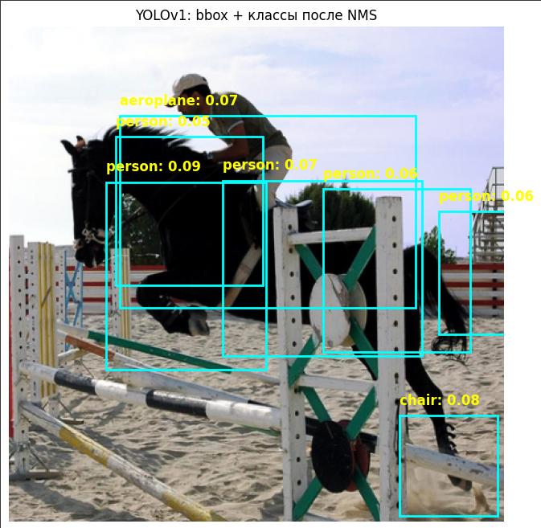

# YOLOv1 Object Detection (PyTorch)

Реализация и обучение модели **YOLOv1** для обнаружения объектов на изображениях с помощью библиотеки PyTorch.

---

## 📌 Что такое YOLOv1?

**YOLO (You Only Look Once)** — архитектура для быстрого обнаружения и классификации объектов на изображении. YOLOv1 — первая версия модели.

---

## 🚩 Ссылка на готовую обученную модель (Pascal VOC):

[👉 Скачать готовую модель YOLOv1](https://drive.google.com/drive/folders/1DeLNXkDqrBZjy99JXugo65BhL_URB1ZA?usp=sharing)

После скачивания поместите файл `yolov1_model.pth` в папку проекта.

---

## 📂 Структура проекта:

```
YOLOv1-PyTorch/
│
├── yolov1_model.pth (скачанная модель)
├── test_model.py (пример использования модели)
├── README.md
├── requirements.txt
└── yolo_v1.py (код обучения и единичный тест для него)
```

---

## 🔨 Как запустить локально:

Создай окружение и установи зависимости:

```bash
pip install -r requirements.txt
```

Запусти пример работы модели на изображениях:

```bash
python test_model.py
```

---

## ⚙️ Зависимости:

- torch
- torchvision
- matplotlib

---

## 🖼️ Пример результата работы модели:

<p align="center">
 
</p>

---

## 💡 Автор проекта:

- **Qosimi Kurush**